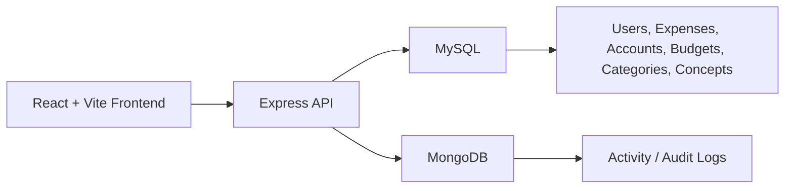

# Personal Finance Management Platform

Full-stack personal finance application for tracking movements, accounts, budgets, real-vs-budget variance, frequent movement presets, and audit activity. The project is designed as a production-oriented portfolio application with secure authentication, relational financial data in MySQL, complementary MongoDB activity logs, Dockerized local execution, Swagger API documentation, and responsive mobile UX validated on real iPhone devices.


## Table of Contents

- [Screenshots](#screenshots)
- [Features](#features)
- [Tech Stack](#tech-stack)
- [Architecture Overview](#architecture-overview)
- [Security](#security)
- [Testing](#testing)
- [Docker Setup](#docker-setup)
- [Local Development Setup](#local-development-setup)
- [API Documentation](#api-documentation)
- [Production Deployment](#production-deployment)
- [Mobile Responsiveness](#mobile-responsiveness)
- [Lessons Learned](#lessons-learned)
- [Future Improvements](#future-improvements)

## Screenshots

Screenshots can be added later under `docs/screenshots/` or any preferred documentation folder.

| View | Placeholder |
| --- | --- |
| Desktop Dashboard | `docs/screenshots/desktop-dashboard.png` |
| Mobile Dashboard | `docs/screenshots/mobile-dashboard.png` |
| Movimientos | `docs/screenshots/movimientos.png` |
| Presupuesto | `docs/screenshots/presupuesto.png` |
| Activity Logs | `docs/screenshots/activity-logs.png` |

## Features

### Financial Management

- Create, edit, filter, delete, and export movements.
- Track income and expenses by category, concept, account, and date.
- Manage financial accounts with active/deactivated states.
- Maintain monthly budgets by concept and year.
- Compare actual spending against budget by month, quarter, semester, YTD, and annual views.
- Review dashboard KPIs, latest movements, top categories, and financial insight summaries.

### Productivity UX

- Frequent movement presets for recurring expenses or income.
- One-tap frequent movement prefill that keeps amount empty for safer entry.
- Mobile-native movement list layout instead of compressed desktop tables.
- Responsive filters, forms, cards, tables, and navigation.
- Real-device mobile polish for iPhone Safari behavior.

### Administration and Auditability

- JWT authentication with protected backend routes.
- Admin-only user management.
- Role-based authorization middleware.
- MongoDB activity/audit log module for login, account, budget, expense, and user events.
- Activity page with period filters and readable audit rows.

## Tech Stack

| Area | Technologies |
| --- | --- |
| Frontend | React, Vite, React Router, Recharts, Boxicons, CSS |
| Backend | Node.js, Express, JWT, bcrypt, Helmet, express-rate-limit |
| Databases | MySQL, MongoDB |
| ORM / Data Access | Sequelize, mysql2, Mongoose |
| Infrastructure | Docker, Docker Compose, nginx frontend container, DigitalOcean VPS |
| Testing | Jest, Supertest |
| API Docs | Swagger / OpenAPI 3.0 |

## Architecture Overview

The application separates the financial source of truth from audit logging:



### Data Ownership

| Data area | Database | Notes |
| --- | --- | --- |
| Users | MySQL | Authentication and role data |
| Expenses / movements | MySQL | Core financial records |
| Accounts | MySQL | User-owned financial accounts |
| Budgets | MySQL | Monthly planning data |
| Categories / concepts | MySQL | Shared financial catalog |
| Reports | MySQL | Generated from budget and expense data |
| Activity logs | MongoDB | Complementary audit trail only |

### Dockerized Services

Docker Compose runs the project as separate services:

- `frontend`: production-built Vite app served by nginx.
- `backend`: Express API.
- `mysql`: MySQL 8 with fresh-volume initialization.
- `mongo`: MongoDB 7 for activity logs.

The backend uses Docker service names internally:

- MySQL: `mysql:3306`
- MongoDB: `mongo:27017`

## Security

Security features implemented in the backend:

- JWT-based authentication.
- Password hashing with bcrypt.
- Protected routes through `authMiddleware`.
- Admin-only operations through `adminMiddleware`.
- Helmet for common HTTP security headers.
- Rate limiting for general API traffic and stricter auth endpoints.
- Explicit CORS allowlist for local frontend, backend Swagger origin, `FRONTEND_URL`, and `API_URL`.
- Backend uses `req.user.id` from the JWT instead of trusting `user_id` from the frontend.
- No real production secrets are committed to Dockerfiles or documentation.

## Testing

Backend automated testing uses Jest and Supertest.

Current validation:

| Test area | Coverage |
| --- | --- |
| Auth | register, login, protected-route behavior |
| Middleware | auth/admin access controls |
| Accounts | create, get, update, deactivate |
| Expenses | create, get, update, delete |
| Favorite movements | create, get, delete, per-user scope, max limit |
| Activity | protected access, per-user visibility, expense log creation |
| Validation | API payload and error behavior |

Current result:

```bash
Test Suites: 7 passed, 7 total
Tests:       39 passed, 39 total
```

Run backend tests:

```bash
cd backend
npm test
```

## Docker Setup

The fastest way to run the full application locally is Docker Compose.

```bash
docker compose up --build
```

Access points:

| Service | URL |
| --- | --- |
| Frontend | http://localhost:5173 |
| Backend API | http://localhost:3000 |
| Swagger UI | http://localhost:3000/api-docs |
| MySQL from host | `localhost:3307` |
| MongoDB from host | `localhost:27018` |

Demo Docker login:

```text
Email: admin.docker@example.com
Password: DockerDemo123!
```

Stop containers:

```bash
docker compose down
```

Reset Docker databases and rerun MySQL initialization:

```bash
docker compose down -v
docker compose up --build
```

The Docker MySQL init script is:

```text
backend/sql/init.sql
```

It creates the app schema, category/concept catalog, a demo admin user, demo accounts, budgets, expenses, and frequent movement presets for a fresh Docker volume.

## Local Development Setup

### Prerequisites

- Node.js 20 or compatible LTS release.
- MySQL 8.
- MongoDB, optional for activity logging during local development.
- npm.

### Backend

```bash
cd backend
npm install
```

Create a backend `.env` file with local values:

```env
PORT=3000
DB_HOST=127.0.0.1
DB_PORT=3306
DB_NAME=expenses_report
DB_USER=your_mysql_user
DB_PASSWORD=your_mysql_password
JWT_SECRET=replace_with_a_local_secret
JWT_EXPIRES_IN=1d
MONGO_URI=mongodb://127.0.0.1:27017/expenses_activity
FRONTEND_URL=http://localhost:5173
API_URL=http://localhost:3000
```

Initialize a fresh local MySQL database with the project SQL if needed:

```bash
mysql -h127.0.0.1 -P3306 -u your_mysql_user -p expenses_report < backend/sql/init.sql
```

Start the backend:

```bash
npm run dev
```

### Frontend

```bash
cd frontend
npm install
```

Create a frontend `.env` file when overriding the default backend URL:

```env
VITE_API_URL=http://localhost:3000
```

Start the frontend:

```bash
npm run dev
```

Local development URLs:

- Frontend: http://localhost:5173
- Backend: http://localhost:3000
- Swagger: http://localhost:3000/api-docs

## API Documentation

Swagger UI is available at:

```text
http://localhost:3000/api-docs
```

Swagger/OpenAPI coverage includes:

- Auth
- Users
- Expenses
- Accounts
- Budgets
- Reports
- Activity
- Favorite Movements API (used by Movimientos Frecuentes)
- Categories
- Concepts

The OpenAPI configuration uses:

- OpenAPI 3.0.0
- JWT bearer authorization
- `API_URL` for the documented server URL
- Route annotations from `backend/src/routes/*.js`

Swagger "Try it out" works from the backend origin when CORS includes the backend URL through local defaults or `API_URL`.

## Production Deployment

The application has been prepared and validated for VPS-style deployment on DigitalOcean using Docker-based services.

Production-oriented deployment characteristics:

- Frontend is built with Vite and served through nginx.
- Backend reads `PORT`, `FRONTEND_URL`, `API_URL`, database credentials, and `MONGO_URI` from environment variables.
- MySQL remains the primary relational database.
- MongoDB stores only activity/audit logs.
- Docker Compose separates frontend, backend, MySQL, and MongoDB services.
- Secrets are expected to be provided through environment configuration, not hardcoded in Dockerfiles.

No public production URL is listed here because deployment targets can vary by environment.

## Mobile Responsiveness

The frontend was optimized for mobile and tablet use while preserving the desktop layout.

Responsive work includes:

- Mobile dashboard KPI redesign.
- Mobile-safe header and iPhone notch spacing.
- Collapsible mobile navigation drawer.
- Mobile-native Movimientos list.
- Responsive forms and filters.
- Horizontally scrollable complex tables where appropriate.
- Mobile cards for account and user management pages.
- Activity log rows redesigned for mobile readability.

Validation included real iPhone Safari sessions. This was important because browser responsive emulation did not fully reproduce all real-device overflow and safe-area issues.

## Lessons Learned

### Incremental Architecture

The backend evolved incrementally rather than through a full rewrite. Sequelize was introduced module by module for Accounts, Expenses, Budgets, and Reports while leaving other stable controllers on their existing implementations. This reduced risk and preserved API compatibility during migration.

### Complementary Data Stores

MySQL remains the source of truth for financial and user data, while MongoDB is used only for flexible activity logs. This separation keeps relational reporting reliable while allowing audit metadata to vary by event type.

### Responsive Debugging

Real-device testing exposed layout issues that desktop responsive tools did not show, especially around mobile Safari width, safe-area spacing, native date inputs, and table density. The final mobile experience required targeted mobile layouts rather than simply shrinking desktop tables.

### Docker Deployment

Containerizing the app clarified service boundaries, environment variables, database initialization, and repeatable local execution. Docker also made it easier to test the full stack with a clean MySQL and MongoDB setup.

### Security Hardening

JWT authentication, bcrypt password hashing, rate limiting, Helmet, role-based middleware, protected routes, and explicit CORS rules were necessary to move from course-level CRUD toward production-style backend behavior.

### Modular Backend Design

Route, controller, middleware, model, and utility boundaries made it easier to add activity logging, frequent movement presets, Sequelize models, and Swagger documentation without changing unrelated features.

## Future Improvements

- Add CI/CD for automated tests, builds, and deployment.
- Add production monitoring and structured logging.
- Add uptime and health-check dashboards.
- Continue typography standardization across the frontend.
- Extract a centralized design system for cards, buttons, tables, forms, and mobile patterns.
- Add deeper API integration tests for reports and budgets.
- Add query performance review and indexes where needed.
- Add backup/restore documentation for MySQL and MongoDB volumes.
- Explore service separation or microservice evolution if traffic or ownership boundaries justify it.
