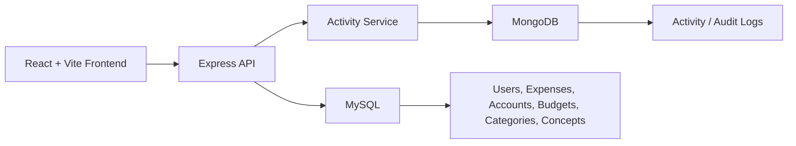

# DexForge – Administrador de Finanzas Personales

DexForge es una aplicación web de finanzas personales desarrollada como parte del proyecto final de una Certificación Full Stack Developer. Permite registrar ingresos y gastos, administrar cuentas, crear presupuestos, comparar presupuesto vs gasto real y consultar el historial de actividad en un solo lugar. El proyecto comenzó como una idea inspirada en una hoja de cálculo personal y evolucionó hasta convertirse en una aplicación full stack desplegada con dominio y servidor propios.


## Tabla de Contenidos

- [Capturas de pantalla](#capturas-de-pantalla)
- [Funcionalidades](#funcionalidades)
- [Tecnologías](#tecnologías)
- [Entregables del curso](#entregables-del-curso)
- [Cómo funciona el proyecto](#cómo-funciona-el-proyecto)
- [Seguridad y protección del usuario](#seguridad-y-protección-del-usuario)
- [Pruebas](#pruebas)
- [Configuración con Docker](#configuración-con-docker)
- [Configuración para desarrollo local](#configuración-para-desarrollo-local)
- [Documentación de la API](#documentación-de-la-api)
- [Despliegue](#despliegue)
- [Experiencia móvil](#experiencia-móvil)
- [Aprendizajes](#aprendizajes)
- [Próximas Mejoras](#próximas-mejoras)

## Capturas de pantalla

Las capturas se pueden agregar después en `docs/screenshots/` o cualquier carpeta de documentación.

| Vista | Ejemplo |
| --- | --- |
| Escritorio - Dashboard | `docs/screenshots/desktop-dashboard.png` |
| Móvil - Dashboard | `docs/screenshots/mobile-dashboard.png` |
| Movimientos | `docs/screenshots/movimientos.png` |
| Presupuesto | `docs/screenshots/presupuesto.png` |
| Historial de actividad | `docs/screenshots/activity-logs.png` |

## Funcionalidades

### Gestión financiera

- Crear, editar, filtrar, eliminar y exportar movimientos.
- Registrar ingresos y gastos por categoría, concepto, cuenta y fecha.
- Administrar cuentas con estados activas/inactivas.
- Crear presupuestos mensuales por concepto y año.
- Comparar gasto real vs presupuesto por mes, trimestre, semestre, año en curso y anual.
- Revisar KPIs del dashboard, últimos movimientos, categorías principales y resúmenes financieros.

### Experiencia de usuario productiva

- Movimientos frecuentes para gastos o ingresos repetitivos.
- Prefill de movimientos frecuentes dejando el monto vacío para evitar errores.
- Lista de movimientos adaptada a móvil, no solo tablas comprimidas.
- Filtros, formularios, tarjetas, tablas y navegación responsivos.
- Ajustes para uso real en iPhone Safari.

### Administración y auditoría

- Autenticación JWT y rutas protegidas en el backend.
- Recuperación de contraseña por correo (Resend) con respuestas genéricas.
- Gestión de usuarios solo para admin.
- Middleware de autorización por roles.
- Registro de actividad/auditoría en MongoDB para login, cuentas, presupuestos, gastos y usuarios.
- Página de actividad con filtros por periodo y registros legibles.

## Tecnologías

| Área | Tecnologías |
| --- | --- |
| Frontend | React, Vite, React Router, Recharts, Boxicons, CSS |
| Backend | Node.js, Express, JWT, bcrypt, Helmet, express-rate-limit |
| Bases de datos | MySQL, MongoDB |
| ORM / Acceso a datos | Sequelize, mysql2, Mongoose |
| Infraestructura | Docker, Docker Compose, nginx, VPS DigitalOcean |
| Pruebas | Jest, Supertest |
| Docs API | Swagger / OpenAPI 3.0 |

## Entregables del curso

Resumen de cómo fue avanzando el proyecto según los requisitos del curso backend.

### Avance 1: Servidor Node.js básico

- Proyecto Node.js inicializado con npm y scripts en `package.json` para desarrollo, producción, pruebas y builds.
- Punto de entrada Express en `backend/src/server.js`.
- App principal Express en `backend/src/app.js`.
- Respuesta de salud en `/`.
- Chequeo de conexión a la base de datos en `/test-db`.
- Uso de patrones asíncronos en Node.js con `async` / `await`, handlers no bloqueantes, queries MySQL, conexión MongoDB y logging de actividad.

### Avance 2: Aplicación web segura

- Código backend organizado en rutas, controladores, modelos, middleware, config y utilidades.
- Rutas Express para auth, usuarios, gastos, cuentas, presupuestos, reportes, actividad, movimientos frecuentes, categorías y conceptos.
- Middleware para parsing JSON, CORS con lista blanca, Helmet, rate limiting general y específico para auth, autenticación JWT y autorización admin.
- Autenticación con JWT y bcrypt.
- Autorización por rutas protegidas y middleware admin para gestión de usuarios.
- Prevención de ataques: validación de requests, sanitización de texto, queries Sequelize, queries `mysql2` con parámetros, rendering React sin HTML directo y pruebas de regresión para SQLi/XSS.

### Avance 3: Bases de datos, entornos y pruebas

- MySQL como fuente principal para usuarios, movimientos, cuentas, presupuestos, categorías, conceptos y reportes.
- MongoDB para logs de actividad/auditoría como módulo complementario.
- Modelos Sequelize para cuentas, gastos, presupuestos, reportes, catálogos y movimientos frecuentes.
- Mongoose para documentos de logs de actividad.
- Configuración de entorno con `dotenv`, validación de arranque en producción y variables en Docker Compose.
- Validación automatizada backend con Jest y Supertest.
- Resultado actual: 8 suites de prueba / 51 tests pasan.

### Avance 4: Contenedores, microservicio, optimización, monitoreo y debugging

- Docker Compose corre `frontend`, `backend`, `activity-service`, `mysql` y `mongo` como servicios separados.
- `activity-service` es un microservicio Node.js/Express dedicado para escribir logs de actividad en MongoDB vía `/activity/logs`.
- El backend llama al microservicio de actividad por `ACTIVITY_SERVICE_URL` y si no está disponible usa logging local en Mongo.
- El microservicio de actividad expone `/health` para validación.
- MySQL y MongoDB tienen healthchecks de Docker.
- Despliegue en producción validado en DigitalOcean con `docker compose ps`, logs, `curl` al endpoint de health, dominio público y Swagger UI.
- Medidas de optimización: pool de conexiones Sequelize, límite de queries para lecturas, rate limiting API, build frontend estático servido por nginx y puertos Docker solo a localhost en producción.
- Debugging y validación con tests automáticos, validación de config Docker Compose, logs de contenedores, builds de imágenes y chequeos de endpoints.

## Cómo funciona el proyecto

La aplicación usa MySQL como base de datos principal y MongoDB para guardar el historial de actividad. El frontend se comunica con la API backend y los usuarios interactúan mediante una interfaz web responsiva.



### Propiedad de los datos

| Área de datos | Base de datos | Notas |
| --- | --- | --- |
| Usuarios | MySQL | Datos de autenticación y rol |
| Gastos / movimientos | MySQL | Registros financieros principales |
| Cuentas | MySQL | Cuentas financieras del usuario |
| Presupuestos | MySQL | Datos de planeación mensual |
| Categorías / conceptos | MySQL | Catálogo compartido |
| Reportes | MySQL | Generados desde presupuesto y gastos |
| Logs de actividad | MongoDB | Solo auditoría complementaria |

### Servicios Dockerizados

Docker Compose ejecuta el proyecto en servicios separados:

- `frontend`: app Vite en producción servida por nginx.
- `backend`: API Express.
- `activity-service`: microservicio Express dedicado para logs/auditoría en MongoDB.
- `mysql`: MySQL 8 con volumen nuevo.
- `mongo`: MongoDB 7 para logs de actividad.

El backend usa los nombres de servicio Docker internamente:

- MySQL: `mysql:3306`
- MongoDB: `mongo:27017`
- Activity Service: `activity-service:3001`

## Seguridad y protección del usuario

Se añadieron varias protecciones para acercar la app a un entorno real:

- Autenticación con JWT.
- Hash de contraseñas con bcrypt.
- Rutas protegidas usando `authMiddleware`.
- Operaciones solo admin con `adminMiddleware`.
- Helmet para headers HTTP seguros.
- Rate limiting para la API y aún más estricto para endpoints de auth.
- Lista blanca CORS para frontend local, Swagger backend, `FRONTEND_URL` y `API_URL`.
- El backend usa `req.user.id` del JWT y nunca confía en `user_id` desde el frontend.
- No se suben secretos reales de producción a Dockerfiles ni documentación.

### Medidas de seguridad

- Protección SQL Injection: módulos financieros usan queries ORM de Sequelize y los queries `mysql2` usan parámetros en vez de concatenar input.
- Protección XSS: React escapa valores por defecto y el frontend no usa APIs como `dangerouslySetInnerHTML` o `innerHTML`.
- Sanitización de input: helpers backend limpian texto de usuarios, eliminan caracteres ocultos, pero permiten acentos, emojis y puntuación normal.
- Headers de seguridad: Helmet está habilitado en la API Express.
- Tráfico seguro: producción sirve detrás de HTTPS vía nginx reverse proxy.
- Controles de abuso: rate limiting global y específico para endpoints de auth para evitar fuerza bruta y spam.

## Pruebas

Las pruebas automatizadas backend usan Jest y Supertest.

Cobertura actual:

| Área de prueba | Cobertura |
| --- | --- |
| Auth | registro, login, rutas protegidas |
| Middleware | controles de acceso auth/admin |
| Cuentas | crear, obtener, actualizar, desactivar |
| Gastos | crear, obtener, actualizar, eliminar |
| Movimientos frecuentes | crear, obtener, eliminar, por usuario, límite máximo |
| Actividad | acceso protegido, visibilidad por usuario, creación de logs de gasto |
| Validación | payloads y errores de la API |
| Seguridad | payloads SQLi, manejo de XSS, escaneo de HTML directo |

Resultado actual:

```bash
Test Suites: 8 passed, 8 total
Tests:       51 passed, 51 total
```

Ejecutar pruebas backend:

```bash
cd backend
npm test
```

## Configuración con Docker

La forma más rápida de correr toda la app localmente es con Docker Compose.

```bash
docker compose up --build
```

Puntos de acceso:

| Servicio | URL |
| --- | --- |
| Frontend | http://localhost:5173 |
| Backend API | http://localhost:3000 |
| Health Activity Service | http://localhost:3001/health |
| Swagger UI | http://localhost:3000/api-docs |
| MySQL desde host | `localhost:3307` |
| MongoDB desde host | `localhost:27018` |

Login demo Docker:

```text
Email: admin.docker@example.com
Password: DockerDemo123!
```

Detener los contenedores:

```bash
docker compose down
```

Reiniciar bases Docker y re-correr init MySQL:

```bash
docker compose down -v
docker compose up --build
```

El script de inicialización MySQL de Docker es:

```text
backend/sql/init.sql
```

Crea el esquema, catálogos de categorías/conceptos, usuario admin demo, cuentas demo, presupuestos, gastos y presets de movimientos frecuentes para un volumen Docker limpio.

## Configuración para desarrollo local

### Requisitos previos

- Node.js 20 o LTS compatible.
- MySQL 8.
- MongoDB (opcional, para logs de actividad en desarrollo local).
- npm.

### Backend

```bash
cd backend
npm install
```

Crea un archivo `.env` en backend con valores locales:

```env
PORT=3000
DB_HOST=127.0.0.1
DB_PORT=3306
DB_NAME=expenses_report
DB_USER=your_mysql_user
DB_PASSWORD=your_mysql_password
JWT_SECRET=replace_with_a_local_secret
JWT_EXPIRES_IN=1d
RESET_TOKEN_EXPIRES_MINUTES=30
MONGO_URI=mongodb://127.0.0.1:27017/expenses_activity
FRONTEND_URL=http://localhost:5173
API_URL=http://localhost:3000
RESEND_API_KEY=your_resend_api_key
EMAIL_FROM="Expenses Report <support@example.com>"
```

Las solicitudes para resetear contraseña mandan solo el enlace si Resend está configurado. Los links expiran a los 30 minutos por defecto. En desarrollo local puedes probar el flujo aunque no tengas Resend, ya que la respuesta API y logs muestran el token; en producción nunca se expone el token.

Inicializa la base MySQL local con el SQL del proyecto si lo necesitas:

```bash
mysql -h127.0.0.1 -P3306 -u your_mysql_user -p expenses_report < backend/sql/init.sql
```

Inicia el backend:

```bash
npm run dev
```

### Frontend

```bash
cd frontend
npm install
```

Crea un archivo `.env` en frontend si quieres cambiar la URL del backend:

```env
VITE_API_URL=http://localhost:3000
```

Inicia el frontend:

```bash
npm run dev
```

URLs para desarrollo local:

- Frontend: http://localhost:5173
- Backend: http://localhost:3000
- Swagger: http://localhost:3000/api-docs

## Documentación de la API

Swagger UI disponible en:

```text
http://localhost:3000/api-docs
```

Swagger/OpenAPI cubre:

- Auth
- Usuarios
- Gastos
- Cuentas
- Presupuestos
- Reportes
- Actividad
- API de Movimientos Frecuentes (usada por Movimientos Frecuentes)
- Categorías
- Conceptos

La configuración OpenAPI usa:

- OpenAPI 3.0.0
- Autorización JWT bearer
- `API_URL` como URL de servidor documentada
- Anotaciones de rutas en `backend/src/routes/*.js`

El botón "Try it out" de Swagger funciona desde el backend si CORS incluye la URL backend por defecto local o por `API_URL`.

## Despliegue

La versión final del proyecto se desplegó en un VPS y se conectó a un dominio propio. Así la app puede funcionar fuera del entorno local y comportarse como un despliegue real.

Características del despliegue:

- Frontend compilado con Vite y servido por nginx.
- Backend lee `PORT`, `FRONTEND_URL`, `API_URL`, credenciales de base de datos y `MONGO_URI` de variables de entorno.
- El correo de recuperación de contraseña requiere Resend: `RESEND_API_KEY` y `EMAIL_FROM`.
- MySQL es la base relacional principal.
- MongoDB solo almacena logs/auditoría.
- Docker Compose separa frontend, backend, activity-service, MySQL y MongoDB.
- Los secretos se pasan por configuración de entorno, nunca hardcodeados en Dockerfiles.

No se publica aquí la URL de producción, ya que puede variar según el entorno.

## Experiencia móvil

El frontend fue optimizado para móviles y tablets, manteniendo el diseño de escritorio.

Mejoras responsivas:

- Rediseño de KPIs del dashboard para móvil.
- Header seguro para notch de iPhone.
- Menú lateral colapsable en móvil.
- Lista de Movimientos nativa para móvil.
- Formularios y filtros responsivos.
- Tablas complejas con scroll horizontal donde aplica.
- Tarjetas móviles para cuentas y gestión de usuarios.
- Registros de actividad adaptados para mejor lectura en móvil.

Se validó en iPhone real, ya que el emulador del navegador no reproduce todos los problemas de overflow y áreas seguras.

## Aprendizajes

El proyecto creció mucho más de lo planeado y ayudó a reforzar conceptos más allá de CRUD básico.

Principales aprendizajes:

- Diseñar la base de datos es más fácil al inicio que modificarla después.
- El comportamiento móvil se debe probar en dispositivos reales, no solo en emuladores.
- Docker simplifica la configuración y reduce diferencias de entorno.
- La seguridad requiere decisiones en frontend, backend e infraestructura.
- Un buen diseño de UI reduce errores del usuario.
- Es mejor entregar algo funcional y mejorarlo después, que intentar hacer todo perfecto desde el principio.

La próxima versión del proyecto buscará reducir deuda técnica, simplificar estilos, mejorar componentes reutilizables y facilitar el mantenimiento.

## Próximas Mejoras

- Simplificar y reorganizar estilos del frontend.
- Consolidar componentes UI reutilizables.
- Mejorar reportes y dashboards.
- Agregar más opciones de exportación.
- Ampliar pruebas automatizadas.
- Mejorar automatización de despliegue.
- Seguir mejorando la experiencia móvil.
- Agregar onboarding y ayuda dentro de la app.
