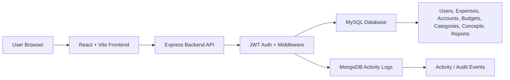
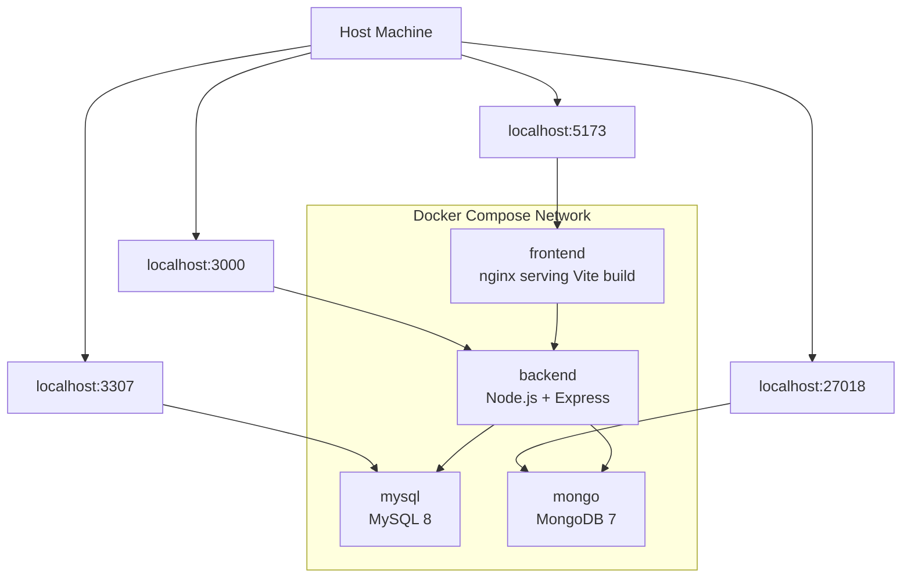
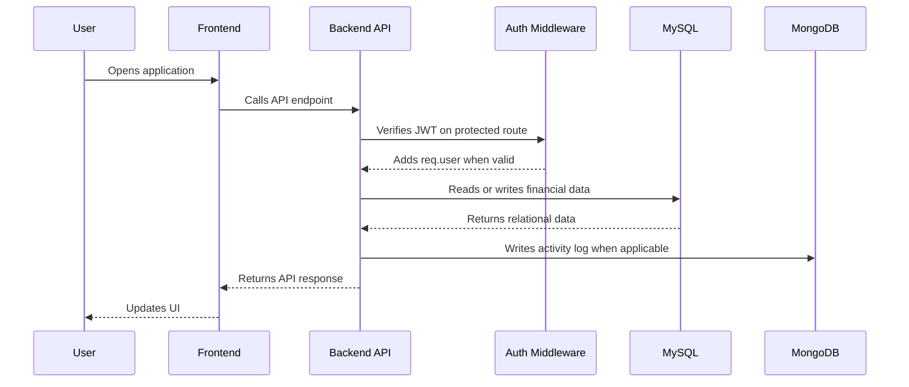
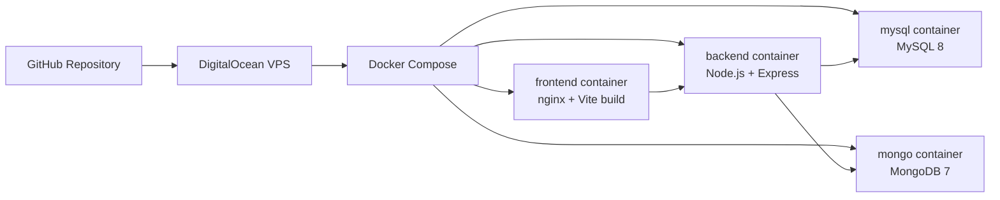

# Expenses Report Architecture

This document summarizes the production-oriented architecture for Expenses Report: a React frontend, an Express API, MySQL as the financial source of truth, and MongoDB as a complementary audit log store.

## High-Level Architecture

The frontend is responsible for the user experience and calls the backend through the configured API base URL. The backend owns authentication, authorization, validation, business rules, financial persistence, reporting queries, and activity logging.

## Docker Compose Services

Inside Docker Compose, the backend connects to databases through service names instead of localhost:

- MySQL: `mysql:3306`
- MongoDB: `mongo:27017`

Host ports `3307` and `27018` are used to avoid common conflicts with local MySQL and MongoDB installations.

## Data Ownership

MySQL remains the primary relational database and source of truth for financial and user data.

| Data area | Database | Notes |
| --- | --- | --- |
| Users | MySQL | Authentication identity, roles, active status |
| Expenses | MySQL | Income and expense movement records |
| Accounts | MySQL | User-owned financial accounts |
| Budgets | MySQL | Monthly budget values by concept and year |
| Categories | MySQL | Shared financial category catalog |
| Concepts | MySQL | Shared financial concept catalog |
| Reports | MySQL | Generated from budget and expense data |
| Activity logs | MongoDB | Flexible audit/event records only |

MongoDB is intentionally limited to activity/audit logs. It does not replace or duplicate the core financial data model.

## Request Flow

Typical protected operations follow this path:

1. The user opens the React frontend.
2. The frontend calls the backend API using the configured base URL.
3. The backend verifies the JWT through auth middleware.
4. Controllers use `req.user.id` instead of trusting frontend `user_id`.
5. The backend reads or writes financial data in MySQL.
6. Important user actions are logged to MongoDB through the activity logger.
7. The backend returns the response expected by the frontend.

## Deployment Flow

Deployment uses Dockerized services so the same service boundaries can run locally or on a VPS. Production deployments must provide explicit environment values for secrets, database credentials, CORS origins, API URLs, and MongoDB connection strings. Docker demo defaults are for local testing only.

## Security Layer Summary

The backend applies security controls at multiple layers:

| Layer | Purpose |
| --- | --- |
| Helmet | Adds common HTTP security headers |
| CORS allowlist | Restricts browser origins to local/dev and configured production URLs |
| Rate limiting | Limits general API traffic and applies stricter auth endpoint limits |
| JWT auth | Protects authenticated routes and identifies the current user |
| Admin middleware | Restricts user-management operations to admin accounts |
| Validation helpers | Reject invalid IDs, dates, amounts, months, years, and payload shapes before database access |
| Startup env validation | Fails fast in production when required environment variables are missing |

The backend keeps user scoping on the server side and uses `req.user.id` from the JWT for user-owned resources.
